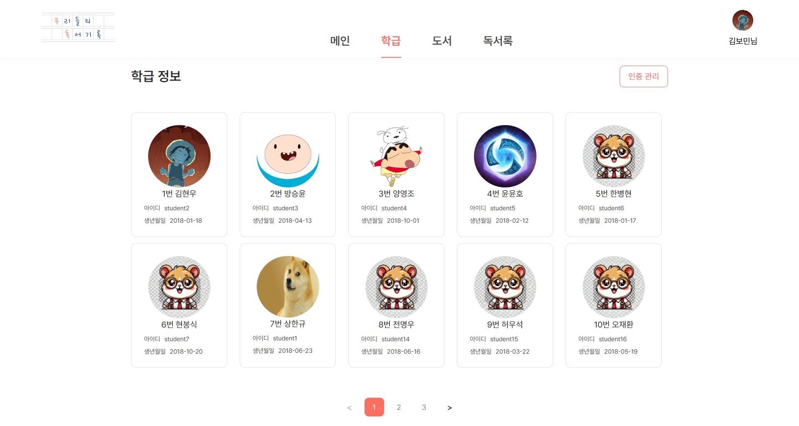
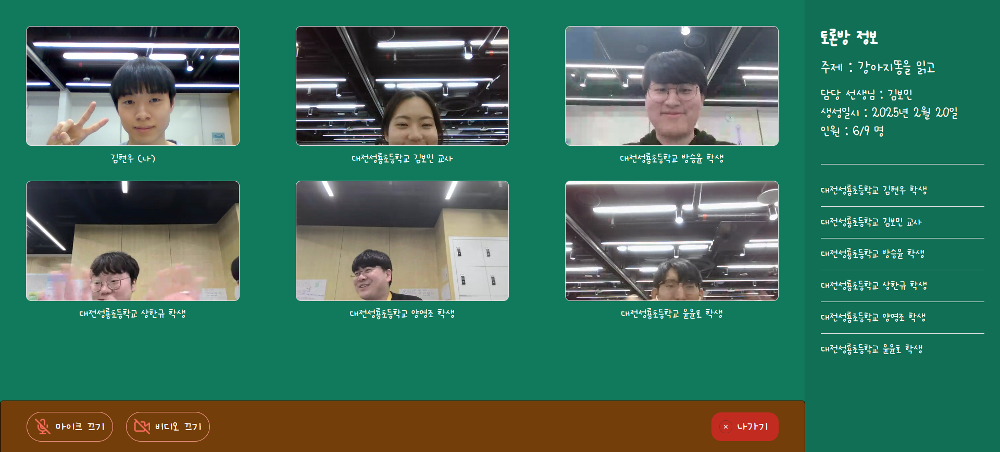
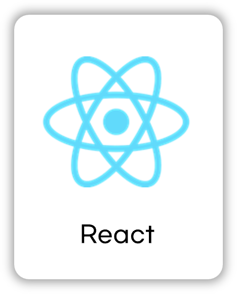
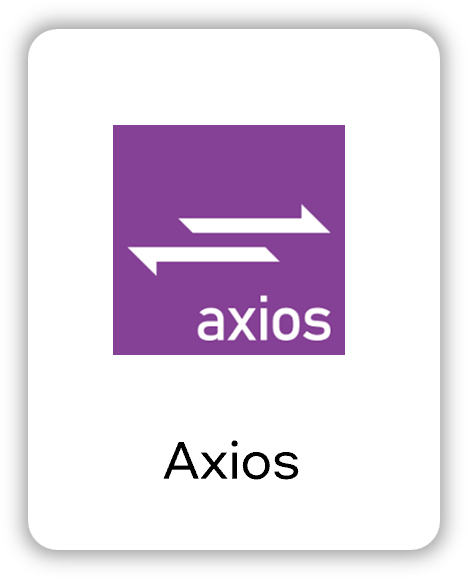
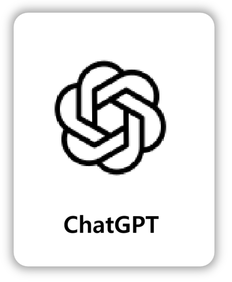

&nbsp;&nbsp;&nbsp;&nbsp;&nbsp;&nbsp;&nbsp;&nbsp;&nbsp;&nbsp;&nbsp;&nbsp;&nbsp;&nbsp;&nbsp;&nbsp;&nbsp;&nbsp;&nbsp;&nbsp;&nbsp;&nbsp;&nbsp;&nbsp;&nbsp;

 

# 📘 서비스명

## 우리들의 독서기록

> 업무강도가 높은 초등학교 교사를 위한 독서록 관리 및 피드백 서비스

## 기획 의도

> 교사는 시간의 한계로 학생들의 독서록 지도에 어려움을 겪고 있음  
> 교사는 기본적인 업무 + 수업준비 + 학생관리 등 시간이 매우 부족한 상황을 해결하고자 서비스를 기획

## 주요 기능

### 교사

- 학생 회원가입 QR 코드 생성
- 전체 학급관리 확인
- 독서록 제출한 학생 실시간 알림(SSE)확인
- 독서토론방 개설 가능
- 숙제 등록 및 학년 추천도서 등록
- 가장 많이 읽은 책 & 반에서 가장 많이 읽은 책 열람 가능
- 지금까지 근무한 학년-반 학생정보 열람 및 독서록 관리

### 학생

- QR코드로 간편한 회원가입
- 내 성취도 현황(칭잔도장, 읽은 횟수) 확인
- 타이핑 독서록 작성 시 내용 AI 피드백
- 독서록 이미지업로드 시 텍스트 변환, 맞춤법 교정
- 선생님이 확인 시 실시간 알림(SSE)
- 선생님이 작성한 숙제도서 확인
- 학년 별 지금까지 작성한 독서록 확인 가능

## 사용 효과

### 교사

- 교사는 기본적인 업무 + 수업준비 + 학생관리 등 시간이 매우 부족한 상황, 교사의 **업무 경감**
- AI 기반 피드백과 RTC 기능을 통해 **효율적인 독서 지도** 지원
- 학생 독서 이력 열람 및 관리로 학생별 독서 기록과 이력을 바탕으로 **맞춤형 독서록 지도** 가능

### 학생

- AI 첨삭 기능을 통해 **문법 및 논리적 표현력 강화**
- 학생들은 본인이 작성한 독서록에 대해 **매번 피드백 받는다.**
- 읽은 책, 작문 내용을 **맞춤법 교정**을 간편하게 받는다.
- 과거에 작성한 독서록 지속적으로 볼 수 있다.

## 실제 서비스 화면

## 교사

  
&nbsp;&nbsp;교사 화면

|           **교사 회원가입**           |        **교사 QR 생성 학생초대**        |
|:-------------------------------:|:-------------------------------:|
|    |    |
|        **교사 학급학생 정보보**기         |           **학급 학생보기**           |
|    |    |
|          **학생 인증 관리**           |           **학생 상세보기**           |
|    |    |
|           **숙제도서 현황**           |        **숙제도서 학급도서 등록**         |
|    |    |
|         **학급학생 독서록 관리**         |        **학생 독서감상문 의견작성**        |
|    |    |
|        **독서감상문 칭찬도장 찍기**        |          **독서토론방 개설**           |
|  |  |
|        **실시간 독서토론 방 현황**        |
|  |

## 학생

  
&nbsp;&nbsp;학생 화면

|           **로그인 화면**            |           **학생 메인화면**           |
|:-------------------------------:|:-------------------------------:|
|    |    |
|           **독서록 알림함**           |           **숙제도서 확인**           |
|    |    |
|            **도서 검색**            |          **책 독서록 현황**           |
|    |    |
|          **독서 감상문 작성**          |         **독서록 이미지 업로드**         |
|    |    |
|        **독서록 AI 맞춤법 검사**        |        **독서록 선생님 의견 보기**        |
|    |    |
|       **학생 독서록 성취도 페이지**        |          **독서토론 방 목록**          |
|  |  |
|         **실시간 독서토론 화면**         |
|  |

## 프로젝트 API 설계

## [👉🏻 API](https://www.notion.so/API-b47f3630abc64a7ebda056f0cb098cbe?pvs=25)

## 🛠️ 프로젝트 아키텍쳐

 

# 🤔 트러블 슈팅

- **OpenVidu - nginxX 충돌**
    - [OpenVidu 포트 충돌에 대해](https://www.notion.so/openvidu-nginx-5a0fdf35c0b448c28779452a451d0cd2?pvs=4)

- **jenkins 구성**
    - [젠킨스 초기 세팅]([OpenVidu 포트 충돌에 대해](https://www.notion.so/openvidu-nginx-5a0fdf35c0b448c28779452a451d0cd2?pvs=4))

- **Java Validation**
    - [요청 값 검증에 대해](https://www.notion.so/Java-Validation-19ec6c90458e8081bf78e9d07530e78e?pvs=4)

- **OCR**
    - [OCR 선택과 이용](https://www.notion.so/OCR-196c6c90458e80d898aafecc118deae4?pvs=4)

- **알림 전송 방식**
    - [알림 전송 4가지 방식과 선택](https://www.notion.so/19fc6c90458e808fa796fac1d3b01a4e?pvs=4)

- **JWT**
    - [JWT 토큰 주의사항](https://www.notion.so/JWT-Enum-19ec6c90458e80959144cc9ecb7bcd07?pvs=4)

<h1>📚 STACKS</h1>

  <h3>FrontEnd</h3>
  
  
  
   
  
  
  

  <h3>BackEnd</h3>
  
  
   
  
  
  

  <h3>Infra</h3>
  
  
   
  
  
  

 

  <h3>외부 서비스</h3>
  
  
  

### 아이디어 선정: 01.06 ~ 01.15 (10일)

# 프로젝트 2025년 일정

### 기획: 02.15 ~ 01.17 (3일)

### 개발: 01.17 ~ 02.17 (1달)

### 테스트 및 QA: 02.10 ~ 02.20 (11일)

### 프로젝트 종료: 02.21

## 💁‍♂️ 프로젝트 팀원

|               Backend                |              Backend               |                Frontend                 |
|:------------------------------------:|:----------------------------------:|:---------------------------------------:|
|  |  |  |
|   [김현우](https://github.com/8resd8)   | [김보민](https://github.com/mokbee1)  |   [양영조](https://github.com/10019610)    |

|               Backend               |                Backend                |                  Frontend                  |
|:-----------------------------------:|:-------------------------------------:|:------------------------------------------:|
|  |  |          |
| [윤윤호](https://github.com/10019610)  |  [방승윤](https://github.com/sybang97)   | [상한규](https://github.com/littlewaterdrops) |

## 프로젝트 팀원 역할

### Backend

- 김보민
    - 팀장 및 기획 총괄
    - 중간 및 최종 발표
    - 발표 PPT 제작 및 스크립트 작성
    - 아이디어 선정 및 구체화
    - JWT 인증 관리 토큰 관리
    - 사용자 초대 및 소속 변경 QR코드 생성
    - 사용자 관리 및 인증 관련 API
    - 필터 및 인터셉터 관련 기능 구현

- 김현우
    - ERD 및 API 설계
    - MySQL RDS 설정
    - AWS S3 구축 및 이미지 업로드 구현
    - 독서록 작성, 교사 칭찬도장 적용 시 SSE 알림으로 실시간 전송 구현
    - 네이버 클로바 OCR 적용, 독서록 이미지 OCR 활용 및 피드백 작성
    - Spring AI를 이용한 변환된 텍스트 향상
    - OpenVidu 화상채팅 프론트 기능구현
    - 전국 초등학교 데이터 DB 삽입
    - 프로젝트 내용 정리 및 문서화

- 방승윤
    - OpenVidu 세션, 커넥션 생성 및 배포
    - 독서토론방 및 접속자 관리
    - 독서록, 책, 학생 및 교사 관련 통계 쿼리 작성
    - 프로젝트 QA 및 테스터, 예외 관리
    - 시연 및 운영에 필요한 데이터 관리

- 윤윤호
    - 백엔드 기술 리더
    - ERD 및 API 설계
    - EC2, Docker, Jenkins CI/CD 구축
    - Nginx 및 HTTPS 인증 설정
    - 도서데이터 수집 및 저장 및 스케줄링
    - 숙제도서, 학급/학년도서, 관심도서 비즈니스 로직 구현
    - 분기에 따른 동적 쿼리 작성
    - 포트폴리오 영상 제작

### Frontend

- 상한규
    - 프론트 기술 리더
    - 프로젝트 매니저, 일정관리
    - 최종발표 PPT 디자인 수정
    - 서비스 컨셉 및 서비스 디자인
    - 서비스 로고 디자인
    - OpenVidu 화면 설계 프론트 구현
    - 공통 컴포넌트 제작
    - 메인 및 통계 화면 구현

- 양영조
    - 서비스 기획 및 정리
    - 중간발표 PPT 디자인 수정
    - 프로젝트 프론트앤드 아키텍트 설계 및 구성
    - 공통 및 교사 세션 포함 핵심 화면 구현
    - OCR 기능 및 GPT 관련 독서록 첨삭 기능 구현
    - 입력에 따른 예외 처리 기능 구현
    - CSS 공통화 적용을 통한 UI/UX 개선