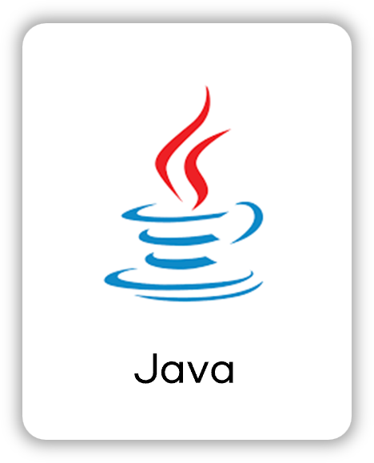

<!-- logo -->

[//]: # (![우리들의 독서기록]&#40;images%2Flogo1.png&#41;)
<h1></h1>

 

# 📚 서비스명

## 우리들의 독서기록

> 업무강도가 높은 초등학교 교사를 위한 독서록 관리 및 피드백 서비스

## 기획 의도

> 교사는 시간의 한계로 학생들의 독서록 지도에 어려움을 겪고 있음  
> 교사는 기본적인 업무 + 수업준비 + 학생관리 등 시간이 매우 부족한 상황을 해결하고자 서비스를 기획

## 주요 기능

### 교사

- 학생 회원가입 QR 코드 생성
- 전체 학급관리 확인
- 독서록 제출한 학생 실시간 알림(SSE)확인
- 독서토론방 개설 가능
- 숙제 등록 및 학년 추천도서 등록
- 가장 많이 읽은 책 & 반에서 가장 많이 읽은 책 열람 가능
- 지금까지 근무한 학년-반 학생정보 열람 및 독서록 관리

### 학생

- QR코드로 간편한 회원가입
- 내 성취도 현황(칭잔도장, 읽은 횟수) 확인
- 타이핑 독서록 작성 시 내용 AI 피드백
- 독서록 이미지업로드 시 텍스트 변환, 맞춤법 교정
- 선생님이 확인 시 실시간 알림(SSE)
- 선생님이 작성한 숙제도서 확인
- 학년 별 지금까지 작성한 독서록 확인 가능

## 사용 효과

### 교사

- 교사는 기본적인 업무 + 수업준비 + 학생관리 등 시간이 매우 부족한 상황, 교사의 **업무 경감**
- AI 기반 피드백과 RTC 기능을 통해 **효율적인 독서 지도** 지원
- 학생 독서 이력 열람 및 관리로 학생별 독서 기록과 이력을 바탕으로 **맞춤형 독서록 지도** 가능

### 학생

- AI 첨삭 기능을 통해 **문법 및 논리적 표현력 강화**
- 학생들은 본인이 작성한 독서록에 대해 **매번 피드백 받는다.**
- 읽은 책, 작문 내용을 **맞춤법 교정**을 간편하게 받는다.
- 과거에 작성한 독서록 지속적으로 볼 수 있다.

## 서비스 화면

## 교사

|                                  로그인 화면                                  |                                교사 숙세도서 현황                                |
|:------------------------------------------------------------------------:|:------------------------------------------------------------------------:|
|                                          |                    |
|                               교사 학생 독서록 관리                               |                                 교사 학급관리                                  |
|              |                  |
|                                 교사 메인화면                                  |                                  학생 통계1                                  |
|                    |                |
|                                  학생 통계2                                  |                              학생 독서록 목록 입장화면                              |
|                |  |
|                                 학생 숙제도서                                  |                               학생 독서감상문 작성                                |
|  |    |
|                                독서감상문 피드백                                 |                                                                          |
|    |                  |
|                               교사 독서토론 방 개설                               |                                Screen #6                                 |
|                    |                    |

## 학생

|              로그인 화면              |                       교사 숙세도서 현황                       |
|:--------------------------------:|:------------------------------------------------------:|
|  |  |
|           교사 학생 독서록 관리           |                        교사 학급관리                         |
|                                  |                                                        |

## 프로젝트 API 설계

- [👉🏻 API](https://www.notion.so/API-b47f3630abc64a7ebda056f0cb098cbe?pvs=25)

## 시스템 아키텍쳐

필요한 기술 스택에 대한 logo는 [skills 폴더](/skills/)에서 다운로드 받을 수 있습니다.

 

#   

### 아이디어 선정: 01.06 ~ 01.15 (10일)

# 프로젝트 2025년 일정

### 기획: 02.15 ~ 01.17 (3일)

### 개발: 01.17 ~ 02.17 (1달)

### 테스트 및 QA: 02.15 ~ 02.20 (5일)

### 프로젝트 종료: 2.21

## 🗂️ APIs

👉🏻 [API 명세서](/backend/APIs.md)

### Back-end

## 🛠️ 프로젝트 아키텍쳐

 

## 🤔 트러블 슈팅

- **OpenVidu - nginxX 충돌**
    - [OpenVidu 포트 충돌에 대해](https://www.notion.so/openvidu-nginx-5a0fdf35c0b448c28779452a451d0cd2?pvs=4)

- **jenkins 구성**
    - [젠킨스 초기 세팅]([OpenVidu 포트 충돌에 대해](https://www.notion.so/openvidu-nginx-5a0fdf35c0b448c28779452a451d0cd2?pvs=4))

- **Java Validation**
    - [요청 값 검증에 대해](https://www.notion.so/Java-Validation-19ec6c90458e8081bf78e9d07530e78e?pvs=4)

- **OCR**
    - [OCR 선택과 이용](https://www.notion.so/OCR-196c6c90458e80d898aafecc118deae4?pvs=4)

- **JWT**
    - [JWT 토큰 주의사항](https://www.notion.so/JWT-Enum-19ec6c90458e80959144cc9ecb7bcd07?pvs=4)

<h1>📚 STACKS</h1>

  <h3>FrontEnd</h3>
  
  
  

  <h3>BackEnd</h3>
  
  
  
  

  <h3>Infra</h3>
  
  
  
  
  

 

## 💁‍♂️ 프로젝트 팀원

|                    Backend                     |              Backend              |                   Frontend                   |
|:----------------------------------------------:|:---------------------------------:|:--------------------------------------------:|
|  |    |  |
|        [김현우](https://github.com/8resd8)        | [김보민](https://github.com/mokbee1) |      [양영조](https://github.com/10019610)      |

|                   Backend                    |                     Backend                      |                  Frontend                  |
|:--------------------------------------------:|:------------------------------------------------:|:------------------------------------------:|
|  |  |  |
|      [윤윤호](https://github.com/10019610)      |        [방승윤](https://github.com/sybang97)        |    [상한규](https://github.com/SeongHo-C)     |

## 프로젝트 팀원 역할

### Backend

- 김보민
    - 팀장
    - 프로젝트 기획
    - JWT 인증 관리
    - QR코드 생성
    - 회원가입 및 로그인

- 김현우
    - MySQL RDS 설정
    - AWS S3 구축 및 이미지 업로드 구현
    - Spring AI를 이용한 독서록 피드백 구현
    - 독서록 작성, 교사 칭찬도장 적용 시 SSE 알림 적용 및 저장
    - 네이버 클로바 OCR 적용, 독서록 OCR 작성 및 피드백 관리
    - OpenVidu 화상채팅 프론트 기능구현
    - 전국 초등학교 데이터 DB 삽입
    - 프로젝트 내용 정리 및 작성

- 방승윤
    - OpenVidu 서버 담당
    - 독서토론방 총괄
    - 통계쿼리 담당
    - 프로젝트 QA & 테스터

- 윤윤호
    - 백엔드 기술 리더
    - EC2, Docker, Jenkins CI/CD 구축
    - Nginx 설정
    - 프로젝트 영상 제작
    - 도서데이터 수집 및 저장
    - 숙제도서, 학급도서, 관심도서 관리

### Frontend

- 상한규
    - 프론트 기술 리더
    - 프로젝트 매니저, 일정관리,
    - 서비스 컨셉 및 서비스 디자인
    - 서비스 로고 디자인
    - OpenVidu 화면 설계 및 정리

- 양영조
    - 핵심 API 화면 구현
    - CSS 다듬기
    - 공통 컴포넌트 제작

  